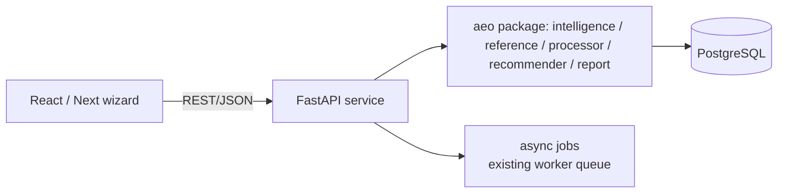

# Product Flow — the guided AEO consultant experience (SP-4 design)

**Status:** design-only this turn. The backend capabilities (SP-1, and the planned
SP-2/SP-3) are real; the UI here is the **SP-4** target. **Stack: FastAPI (backend API)
+ React/Next (frontend).**

The product must feel like *a consultant guiding the user*, not an audit tool: the user
answers a few questions and walks out with a blueprint and an implementation plan they
can hand to a developer. The whole flow is a thin, friendly shell over the deterministic
`SiteProfile` / blueprint / draft engines that already exist.

---

## 1. The 9-step wizard

```
[1] Business Info → [2] Goals → [3] Website Info → [4] Competitors →
[5] Challenges → [6] Analysis → [7] Blueprint → [8] Implementation Plan → [9] Download
```

Steps 1–5 collect input (and decide the **scenario** — e.g. "no website" skips the crawl).
Step 6 runs the analysis. Steps 7–9 present and export the deliverables. A persistent
left rail shows progress; every analysis result is explained in plain language sourced
from `StrategyPlan.headline`/`narrative`, never raw metrics.

### Step 1 — Business Info
```
┌─ Tell us about your business ───────────────────────────┐
│ Name        [ Acme Security            ]                │
│ Industry    [ Cybersecurity        ▼]  → category hint  │
│ Location    [ Boston, US            ]  (optional)       │
│ Services    [ + CTEM ] [ + ASM ] [ + add… ]             │
│                                          [ Continue → ] │
└─────────────────────────────────────────────────────────┘
```
Feeds `category`/`topic` hints → `business_intent` + `framework bootstrap --category`.

### Step 2 — Goals
```
What are you trying to achieve?  (multi-select)
( ) Rank in AI search / answer engines   ( ) Generate leads
( ) Sell products (e-commerce)           ( ) Local foot traffic
( ) Establish topical authority          ( ) Agency: improve a client's site  ← sets agency_mode
```

### Step 3 — Website Info
```
Do you have a website?
( ) Yes  → [ https://acme.com        ]   ( ) No, not yet  → SP-2 no-website path
```
"Yes" → SP-1 crawl path; "No" → SP-2 business-input blueprint (no crawl).

### Step 4 — Competitors
```
Competitors (we'll verify each is reachable):
[ rapid7.com ] [ tenable.com ] [ + add ]    [ Auto-discover ]  ← reference/competitor_discovery.py
```

### Step 5 — Current Challenges (optional, free text → framing only)
```
"What's not working?"  [ we don't show up in ChatGPT/Perplexity answers… ]
```

### Step 6 — Analysis (progress, then the consultant's read)
```
┌─ Analyzing acme.com ────────────────────────────────────┐
│ ✓ Discovered 6 pages   ✓ Classified: SMALL / SaaS       │
│ ✓ Blueprint v3 (15 ideal pages)  ✓ Coverage 40%         │
│ "6-page SaaS site — 40% of the ideal architecture        │
│  covered. Here's how to close the gaps."                 │
│                                          [ See plan →  ] │
└─────────────────────────────────────────────────────────┘
```
This panel is `SiteProfile.to_dict()` rendered: `classification`, `business_intent`,
`scenario`, `headline`.

### Step 7 — Blueprint (the ideal site)
```
┌─ Your ideal site ───────────────────────────────────────┐
│ Sitemap tree (pillars → supporting), FAQ architecture,   │
│ entity & schema recommendations, internal-linking map.   │
│  /resources (pillar)   /what-is-ctem   /faq   …          │
│  ● present  ○ missing                                    │
└─────────────────────────────────────────────────────────┘
```
Renders the `Blueprint.sitemap` + coverage `matched`/`missing`.

### Step 8 — Implementation Plan (prioritized actions)
```
┌─ Do this, in order ─────────────────────────────────────┐
│ 1 ▸ [structure] Add a Contact page            (low)     │
│ 2 ▸ [content]   Create: What is CTEM?          (medium)  │
│ 3 ▸ [journey]   Cover the conversion stage     (medium)  │
│ …   expand → content brief / page spec (SP-3)            │
└─────────────────────────────────────────────────────────┘
```
Renders `StrategyPlan.actions`; expanding an action shows the SP-3 content brief / page
spec / JSON-LD (from `recommender/draft.py`).

### Step 9 — Download Deliverables
```
[ ⬇ AEO Blueprint (PDF) ] [ ⬇ sitemap.xml ] [ ⬇ Content Briefs (zip) ]
[ ⬇ Implementation Plan (PDF) ] [ ⬇ Full JSON ]
```
SP-3 packages these; PDF reuses the existing `report/pdf.py`.

---

## 2. Architecture (SP-4)



- **FastAPI** wraps the existing `aeo` package — it does **not** reimplement logic; each
  endpoint calls a function we already have (`build_site_profile`, `generate_blueprint`,
  `onboard_client`, `draft_site_pages`, report builders).
- Long crawls run as **async jobs** on the existing `pipeline/worker.py` queue; the UI
  polls a job-status endpoint and streams progress for Step 6.
- The frontend is a thin presentation layer over the `SiteProfile`/blueprint/plan JSON.

---

## 3. REST API contract (proposed)

All bodies/responses are JSON. The profile/plan responses are exactly the existing
`SiteProfile.to_dict()` shape (see `UPDATED_ARCHITECTURE.md` §3).

| Method & path | Purpose | Request | Response |
|---|---|---|---|
| `POST /api/profile` | Classify + strategize a live site (SP-1) | `{ "domain": "acme.com", "use_llm": false }` | `SiteProfile` JSON |
| `POST /api/blueprint` | Generate the ideal-site blueprint | `{ "domain"?, "topic"?, "category"? }` | `Blueprint.to_jsonb()` |
| `POST /api/onboard` | One-shot onboarding (SP-2 entry; wraps `onboard_client`) | business brief (name, domain?, industry, services, competitors[], goals[]) | `{ profile, blueprint, targets }` |
| `POST /api/audit` | Full crawl→score→analyze (async) | `{ "domain", "target" }` | `{ "job_id" }` |
| `GET /api/audit/{job_id}` | Poll audit progress | — | `{ status, run_id?, summary? }` |
| `GET /api/site-report/{run_id}` | Persisted site report incl. `sections.strategy` | — | site report JSON |
| `POST /api/deliverables` | Build the dev-ready bundle (SP-3) | `{ "run_id" or "blueprint" }` | `{ "bundle_id", "files": [...] }` |
| `GET /api/deliverables/{id}/{file}` | Download one asset (pdf / sitemap.xml / briefs.zip) | — | file stream |

Example — Step 6 calls:

```jsonc
// POST /api/profile  { "domain": "acme.com", "use_llm": false }
// → 200
{ "domain": "acme.com", "scenario": "small_site",
  "deliverable": "Gap Analysis & Build Plan",
  "headline": "6-page saas site — 40% of the ideal architecture covered…",
  "classification": { "site_class": "small", "page_count": 6, "structure_score": 0.5, … },
  "business_intent": { "model": "saas", "confidence": 0.42, "decided_by": "deterministic" },
  "journey": { "gaps": ["consideration","conversion"], … },
  "actions": [ { "priority": 1, "category": "content", "title": "Create: …", … } ] }
```

---

## 4. Consultant feel — design principles

1. **Lead with the answer, not the metrics.** Every screen opens with the
   `headline`/`narrative`, then lets the user drill into evidence (`scores`, `coverage`).
2. **Always actionable.** No screen ends without a prioritized next step
   (`StrategyPlan.actions`); the terminal state is a downloadable plan, not a dashboard.
3. **Never a dead end.** "No website" and "single page" route to *build/expand* flows, not
   a low score — the deterministic router guarantees a plan for every `SiteClass`.
4. **Explain the why.** Each action carries `detail` + `related_slugs` so the user
   understands the recommendation, not just the directive.
5. **Honest about confidence.** `business_intent.confidence` + `decided_by` are surfaced;
   the user can correct the business model (which re-runs the plan).

---

## 5. Build note

SP-4 is gated on SP-2 (no-website entry) and SP-3 (asset packaging) so the wizard's
Steps 7–9 have real artifacts to present. It gets its own brainstorm + visual-mockup
pass before implementation (UI layout, component library, auth). The API contract above
is the integration seam to design against now.
