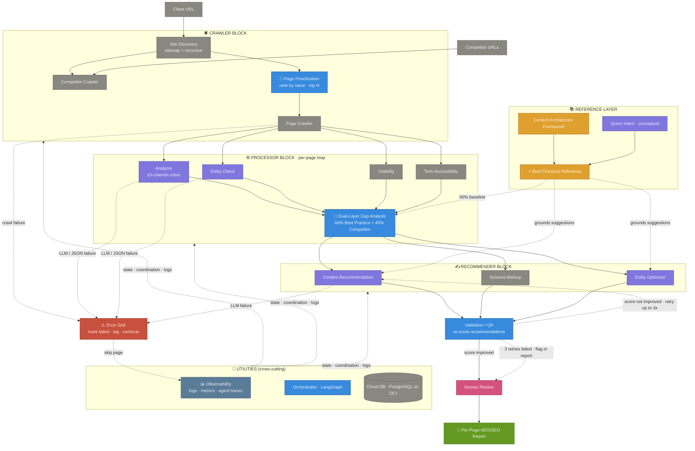

# AEO Multi-Agent Architecture · v3
### v2 + the three things genuinely missing
**Net new in v3:** Page Prioritization · Error handling paths · Observability layer

---

## What Changed from v2 → v3

| # | Addition | Where it lives | Why it matters |
|---|---|---|---|
| 1 | **Page Prioritization** | Crawler Block, between Site Discovery and Page Crawler | Real client sites have hundreds of pages; running the full processor on all is wasteful. Ranks pages by value and cuts to top N. |
| 2 | **Error Sink** + error paths | Cross-cutting (touches Crawler, Processor) | Shows what happens when crawls fail or the LLM returns garbage. The code already handles this; the diagram now reflects it. |
| 3 | **Observability** component | Utilities Block | Logs, metrics, per-agent traces. Without this, debugging bad recommendations is guesswork. |
| 4 | Validation retry-limit (3x) | Validation step | If recommendations can't beat the original score after 3 tries, flag and pass to human — don't loop forever. |

Everything else carries over from v2 unchanged.

---

## Architecture Diagram

---

## The Three Additions Explained

### 1. Page Prioritization (Crawler Block)

Sits between Site Discovery and Page Crawler. Takes the full page inventory and ranks every page by value, then cuts to the top N (suggested starting cutoff: 30 pages).

**Simple ranking heuristic to start with:**

| Page type | Weight |
|---|---|
| Homepage | 100 |
| Product / service pages | 90 |
| Solution / use-case pages | 80 |
| Pillar content / hub pages | 70 |
| Blog / article pages | 50 |
| About / company pages | 30 |
| Contact / legal / utility | 10 |

Multiply by traffic signal if available (Google Search Console export, or simple proxy like internal link count). The Site Discovery step already classifies page types from URL patterns — Prioritization just sorts and slices.

**Output:** ordered list of top N URLs that the per-page loop will actually process.

---

### 2. Error Handling Paths

The diagram now shows what already happens in your code but wasn't visible before:

- **Crawler failure** → write a `crawl_status='failed'` row to the DB, log the error, continue with the next page. This is what `crawler_agent.py` already does.
- **LLM / JSON parse failure** → fall back to a default score record with `gap_analysis.status='SCORING_FAILED'`, log, continue. This is what `gap_analysis_agent.py` already does via the three-strategy JSON extractor.
- **Recommendation failure** → flag the page in the final report as "recommendations unavailable, manual review needed" rather than producing garbage.

All errors flow into the **Error Sink**, which writes to Observability and then skips the failed page so the rest of the pipeline keeps moving. **The key principle is: one bad page never kills a whole run.**

---

### 3. Observability (Utilities)

A logging and tracing layer that every other block writes to. For a project this size you don't need a heavyweight observability stack — start with:

- **Structured logs** (Python `logging` with JSON formatter) per agent, per page
- **Per-page trace** — record every step the page went through and how long each took
- **Per-criterion scores** stored separately so you can answer "why did this page score 3/10 on Entity Check?"

This is the single thing that makes the difference between "I can debug a bad recommendation in 5 minutes" and "I have no idea why the LLM said that, let me read the whole prompt manually."

---

### 4. Validation Retry Limit

A small but important change to the validation loop: cap retries at 3. If after 3 attempts the recommendation still doesn't improve the simulated score, flag the page in the report rather than looping forever. Some pages legitimately can't be improved by the current rubric (already perfect, or content limitations) and the system needs to recognize that.

---

## What's Now in Each Block (Updated)

### 🕷️ Crawler Block
Site Discovery · **Page Prioritization** · Page Crawler · Competitor Crawler

### ⚙️ Processor Block (per-page loop)
Analyzer · Entity Check · Citability · Tech Accessibility · Dual-Layer Gap Analysis

### ✍️ Recommender Block
Content Recommendation · Schema Markup · Entity Optimizer

### 📚 Reference Layer
Best Practices Reference · Content Architecture Framework · Query Intent

### 🔧 Utilities (cross-cutting)
Orchestrator · Cloud DB · **Observability** · **Error Sink**

---

## Updated Team Ownership

| Person | Block | New v3 responsibilities |
|---|---|---|
| **Sanjith** | Crawler + Utilities | Add **Page Prioritization** logic; set up **Observability** (structured logging across the codebase); cloud migration |
| **Kenneth** | Processor | Expand rubric 4 → 10; build Dual-Layer Gap Analysis; cap validation retries at 3 |
| **Aayush** | Reference Layer | Best Practices Reference + Content Architecture Framework (still the critical path) |

---

## Freezing the Diagram

This is v3. **I'm not going to suggest a v4.** The remaining unknowns can only be answered by running the pipeline on a real site:

- The right N for page prioritization (10? 30? 50?) — discover by running it
- The right validation retry threshold — discover by watching how often retries help
- Whether Entity Check and Analyzer should merge into one agent — discover by measuring overlap
- The exact shape of the Best Practices Reference — Aayush discovers by researching

Further diagram iteration without code will not surface these. Build the thinnest end-to-end slice on one client site, then update the diagram with what you learned.

---

*Architecture v3 · supersedes v1 and v2 · diagram now frozen pending real-world feedback*
