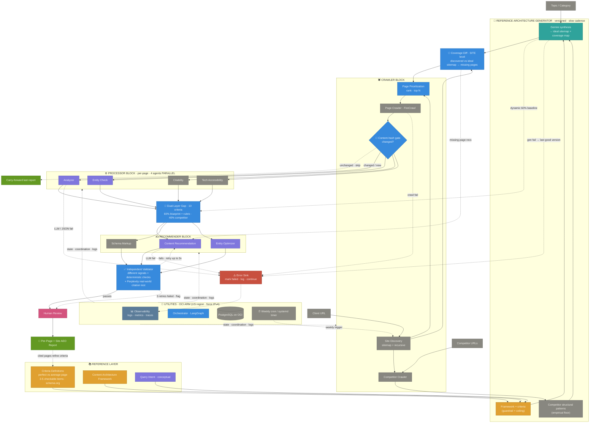

# AEO Multi-Agent Architecture · v4
### v3 + the product-vision expansion: compliance checker → content-strategy engine

**Net new in v4:** Reference Architecture Generator (dynamic, versioned blueprint) · Site-level Coverage Diff · Content-hash caching + Weekly Audit Loop · Independent Validator (fixes circular validation) · Parallel Processor · Validated-wins feedback loop

---

## Why v4 exists

v3 froze the diagram pending real-world feedback. v4 isn't diagram-tinkering — it's a genuine scope change. The product moved from *"score a page against a rubric"* to *"define the ideal site for a topic, then continuously close the gap to it."* That expansion forces structural changes v3 didn't have a place for.

The single biggest shift: the **Reference Layer is no longer static.** v3 measured every client against one generic Best Practices Reference. v4 generates a fresh, versioned blueprint per topic and measures against that. Everything else in v4 supports that move.

---

## What Changed from v3 → v4

| # | Addition | Where it lives | Why it matters |
|---|---|---|---|
| 1 | **Reference Architecture Generator** | New block, between Reference Layer and Processor | Replaces the static Best Practices Reference with a dynamic, versioned, per-topic blueprint (ideal sitemap + coverage map). This is the product's new center of gravity. |
| 2 | **Coverage Diff** (site-level gap) | Between Crawler and Processor | A new *kind* of gap: "which pages are missing entirely," not just "how good is this page." Enables the topical-authority play (10–20 pieces per cluster). |
| 3 | **Content-hash gate + Weekly Audit Loop** | Crawler Block + Utilities cron | Unchanged pages are skipped; a weekly cron re-audits only what changed. Cost control + the "continuous auditing" vision. |
| 4 | **Independent Validator** | Replaces the rubric re-grade in Validation | Fixes *circular validation* — the validator now checks different signals + a real Perplexity citation test, not the same rubric the recommender used. |
| 5 | **Parallel Processor** | Processor Block | The 4 criteria-agents run concurrently instead of in a single line. Notable speedup on the processor stage. |
| 6 | **10-criteria rubric** | Processor | Upgraded 8 → 10. |
| 7 | **Validated-wins feedback loop** | Report → Reference Layer | Pages that *actually get cited* feed back to refine the criteria definitions. Controlled learning — not self-grading. |
| 8 | **Infra: OCI ARM, US region, force IPv4** | Utilities | Hyderabad hit memory/cost limits → migrate to a US region; force IPv4 to stop silent scraper failures on Ampere. |

Everything not listed carries over from v3 unchanged.

---

## Architecture Diagram

---

## The Major Additions Explained

### 1. Reference Architecture Generator (the headline change)

A new block that runs **once per `(client, topic)`** at the start of a run, before the per-page loop. It replaces the static Best Practices Reference as the dynamic 60% baseline. It's a **three-layer hybrid** — not pure-generative, not pure-copy:

- **Layer 1 — empirical floor (Sanjith):** the Competitor Crawler's extracted structural patterns. What Pentera, Cymulate, Picus actually do. Stops the blueprint from being theoretical.
- **Layer 2 — guardrail + ceiling (Aayush):** the curated framework, topic taxonomy, and criteria definitions (perfect vs. average page, 3–5 checkable items). Stops Gemini hallucinating categories, and defines *better-than-competitor* rather than mere parity.
- **Layer 3 — synthesis (Gemini):** combines the two into a candidate blueprint: an **ideal sitemap** (which pages should exist, with type + intent) and a **coverage map** (required entities — MITRE ATT&CK, CVSS, KEV, RemOps — journey stage, and seed questions per node).

**Two modes from one generator:**
- *New site* → no client content to crawl; the blueprint **is** the deliverable ("build these pages").
- *Existing site* → the blueprint feeds the Coverage Diff and the gap analysis.

The generator depends only on `(topic, competitors, framework)` — never on the client — which is what lets it serve both modes.

**Versioning is mandatory.** Regenerating the blueprint every run would move the measuring stick and make week-over-week scores meaningless. So: generate once, version it, pin every run to a version, and regenerate only on a slow cadence (monthly / manual / on competitor drift). When the version bumps, flag it in the report so a score jump reads as "new baseline," not "real change."

---

### 2. Coverage Diff (site-level gap)

After Site Discovery classifies the client's actual pages, the Coverage Diff compares the **discovered sitemap vs. the ideal sitemap** and emits site-level findings: *"missing pillar on Continuous Validation," "thin cluster around RemOps."* This is distinct from the per-page rubric scoring — it answers "which rooms are missing from the house," not "is this room up to code." Its output feeds Page Prioritization and becomes net-new content recommendations in the Recommender.

This gives the system two tiers of gap:
- **Tier A — coverage gap (new):** missing/thin pages, via the blueprint.
- **Tier B — quality gap (v3):** how good each existing page is, via the 10-criteria Dual-Layer analysis.

---

### 3. Content-hash Gate + Weekly Audit Loop

Each crawled page gets a normalized content hash (SHA-256 of main content + schema). On re-run, compare to the stored hash: unchanged → skip the Processor/Recommender/Validation stages and carry the last report forward; changed or new → full processing. The site-level Coverage Diff still runs every week regardless, since missing pages have no hash to compare.

Scheduling note: LangGraph runs the graph, it doesn't schedule itself. On a single always-on OCI VM the cron is just a **systemd timer / crontab** entry that invokes the LangGraph entrypoint weekly — no Cloud Scheduler needed.

---

### 4. Independent Validator (fixes circular validation)

v3's validator re-scored recommendations against the same rubric the recommender used — same rubric, same model, correlated blind spots. v4's validator checks **independent signals**:
- **Deterministic checks:** TLDR under ~50 words, H1 parses as a question, valid JSON-LD present.
- **Real-world signal:** query the target question on **Perplexity** and compare the rewrite's shape (length, directness, citation pattern) to what's actually being cited.

Retry cap stays at 3; after 3 failed attempts the page is flagged for a human rather than looping forever.

---

### 5. Parallel Processor

Analyzer, Entity Check, Citability, and Tech Accessibility are independent (they all feed Dual-Layer Gap separately), so they run concurrently rather than sequentially. The processor *stage* drops from ~4 calls back-to-back toward ~1 call's wall-clock. End-to-end gain is smaller — crawl time is unchanged and Gemini rate limits apply — but it's a clean, low-risk win.

---

### 6. Validated-wins Feedback Loop

The controlled version of "the system evolves itself." Pages that *provably get cited* in Perplexity feed back to refine the **criteria definitions** in the Reference Layer. Note the direction: cited wins improve the *framework*, they do **not** auto-become the blueprint. The client's own recommendations are the deliverable, never the standard — that would just be circular validation one level up.

---

## What's Now in Each Block (Updated)

### 📚 Reference Layer
Criteria Definitions (perfect/average page · 3–5 checkable items · schema.org mappings) · Content Architecture Framework · Query Intent

### 🧭 Reference Architecture Generator *(new)*
Competitor structural patterns (L1) · Framework + criteria (L2) · Gemini synthesis → ideal sitemap + coverage map · versioned + cached

### 🕷️ Crawler Block
Site Discovery · Page Prioritization · Page Crawler · **Content-hash gate** · Competitor Crawler

### 📐 Coverage Diff *(new, site-level)*
Discovered sitemap vs. ideal sitemap → missing/thin pages

### ⚙️ Processor Block (per-page, **parallel**)
Analyzer · Entity Check · Citability · Tech Accessibility → Dual-Layer Gap (10 criteria · 60/40)

### ✍️ Recommender Block
Content Recommendation · Schema Markup · Entity Optimizer · (+ missing-page recs)

### ✅ Validation
**Independent Validator** (different signals + Perplexity citation test) · 3× retry cap · Human Review

### 🔧 Utilities (cross-cutting)
Orchestrator (LangGraph) · PostgreSQL on OCI · Observability · Error Sink · **Weekly cron**

---

## Updated Team Ownership

| Person | Block | v4 responsibilities |
|---|---|---|
| **Sanjith** | Crawler + Utilities + Infra | Content-hash gate + weekly cron; competitor structural-pattern extraction feeding the generator (L1); **US-region migration + force IPv4**; observability |
| **Kenneth** | Processor + Validation | Finish 10-criteria (100%); **parallelize the 4 agents**; build the **Independent Validator** (Perplexity check + 3× retry); own the **blueprint JSON schema contract** |
| **Aayush** | Reference Layer + Generator (L2) | Criteria definitions (perfect/average page · 3–5 checkable items · schema.org); the framework/taxonomy guardrail layer of the generator |
| **R.K** | Standards research | Present the 3 improvements from company-blueprint analysis; ongoing competitor blueprint analysis |

---

## Deferred / Open

- **Multi-engine rubric weighting** (Tier 3): Perplexity vs. ChatGPT Search vs. Gemini reward slightly different things. Don't split the rubric — add a thin `target_engine` weight profile over the shared criteria *later*, once real citation data from the validator tells you which weights to nudge.
- **R.K's 3 improvements:** identified but not yet presented — slot reserved, fold into v4.1 once prioritized.
- **Doc reconciliation:** the formal stack doc still says GCP / Cloud SQL; actual deployment is OCI ARM. Reconcile so the team isn't half-building for two clouds.
- **Scope guard:** confirm the expanded "content-strategy tool" use case is validated and not just scope creep before generalizing beyond one topic.

---

## Build Sequence (thinnest slice first)

1. **Infra unblock:** US-region migration + force IPv4 (deployment is currently stuck on Hyderabad memory).
2. **Lock the blueprint JSON schema** (Kenneth) — the contract between the generator and the gap analysis. Nothing downstream is real until this matches what Aayush's framework produces.
3. **Build the generator for ONE topic — PEV on Securin** — end to end. Prove the blueprint → coverage diff → gap → recommend → validate loop on a single real site.
4. **Wire the parallel processor + content-hash gate + weekly cron.**
5. **Swap in the Independent Validator** with the Perplexity check.
6. Generalize the taxonomy to other topics only after the PEV slice works.

---

*Architecture v4 · supersedes v1–v3 · re-frozen pending the PEV end-to-end slice. The remaining unknowns — right N for prioritization, regeneration cadence, blueprint schema shape — are answered by running it, not by more diagram iteration.*
