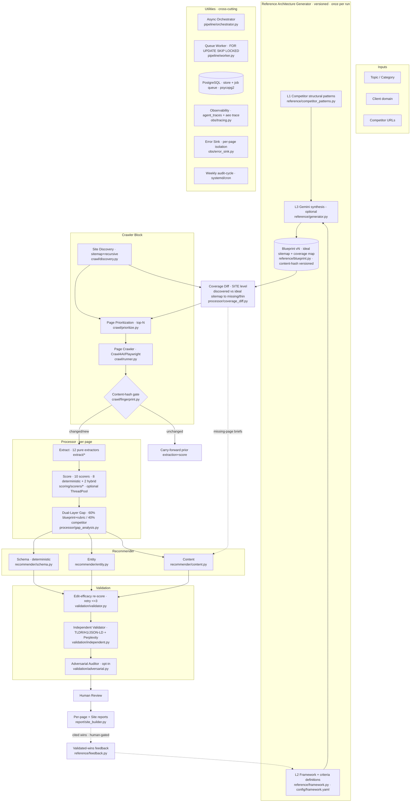

# Architecture A — Kenneth / local `page_crawler` (deterministic-first)

End-to-end data flow as actually wired in code (`src/aeo/pipeline/orchestrator.py`).

**Wiring note:** engine-target routing, the independent validator, and the adversarial auditor are all reachable from the live run path (`orchestrator.py:231-232` → `analysis.py:142-160`), each gated by settings and covered by dedicated tests.
