# Architecture B — Sanjith / `aeo-pipeline` (LLM-first, async-native)

End-to-end data flow as actually wired in code (`src/aeo/cli.py::_pipeline`).

```mermaid
flowchart TD
    subgraph IN[Inputs]
        DC[Per-domain YAML<br/>domains/&#123;domain&#125;.yaml]
        DOM[Domain]
    end

    subgraph BPGEN[Reference Blueprint · Ollama]
        RG[generate_blueprint · phi3<br/>agents/reference_generator.py]
        BP[(Blueprint · frozen core · 30-day lock<br/>models/blueprint.py)]
        RG --> BP
    end
    DC --> RG
    DOM --> RG
    BP -.->|reuse if locked| BPGEN

    subgraph CRAWL[Crawler · async BFS · no LLM]
        CS[crawl_site · httpx async + BeautifulSoup<br/>agents/crawler.py]
        HG{SHA-256 content-hash gate}
        CS --> HG
    end
    DOM --> CS

    subgraph PROCD[Processor · asyncio.gather over changed pages]
        TR[Ollama triage · rank if >50<br/>processor._ollama_triage]
        CD[compute_coverage_diff · per page<br/>agents/coverage_diff.py]
        TR --> CD
    end
    HG -->|changed| TR

    subgraph CDETAIL[Per-page Coverage Diff]
        QC[Query coverage · Ollama semantic]
        EC[Entity coverage · deterministic substring]
        SCH[Schema coverage · deterministic]
        QC & EC & SCH --> SCORE[coverage_score · 0.5q+0.3e+0.2s]
    end
    CD --> SCORE

    REC[Recommender · Ollama · SEQUENTIAL loop<br/>agents/recommender.py]
    SCORE --> REC

    VAL[Validator · deterministic gates only<br/>word>=300 · H1-question · JSON-LD<br/>agents/validator.py::validate_recommendations]
    REC --> VAL
    VAL --> PERSIST[(PostgreSQL · asyncpg<br/>runs/blueprints/pages/coverage/recs/validation)]
    PERSIST --> RPT[aeo report · DB query + rich table]

    subgraph UNWIRED[Built but NOT wired into run path]
        EVG[evaluate_gaps · 4-track engine-routed fan-out]
        AUD[audit_recommendations · adversarial persona + 3x circuit breaker + citation HEAD check]
    end

    subgraph UTIL[Utilities]
        OTEL[OpenTelemetry OTLP tracing<br/>utils/observability.py]
        IPV4[Uniform force-IPv4 client<br/>utils/http.py]
        DRY[--dry-run in-memory demo · <=10 pages]
        TIMER[systemd weekly timer]
    end
```

**Wiring note:** the engine-routed `evaluate_gaps` 4-track evaluator and the `audit_recommendations` adversarial auditor are implemented and smoke-tested but **never called** from `cli.py` or `agents/processor.py` (verified). The live path uses `compute_coverage_diff` (no engine emphasis) and `validate_recommendations` (deterministic gates). There is **no site-level / missing-page coverage diff** — the blueprint has no ideal-sitemap concept.
