# Final Recommended Architecture — A as base + 5 transplants from B

Adopt **Architecture A** as the system of record; port a small set of B's genuinely-better, low-risk components onto it. Green = transplanted from B.

```mermaid
flowchart TD
    subgraph ONB[Onboarding · PORT FROM B]
        YML[Per-domain YAML config<br/>domains/&#123;domain&#125;.yaml to drive engine_target,<br/>seed_queries, competitors]
    end

    subgraph REF[Reference Architecture Generator · A]
        L1[L1 competitor patterns]
        L2[L2 framework + criteria]
        L3[L3 Gemini synthesis · engine-routed prompt emphasis PORT FROM B]
        BP[(Blueprint vN · ideal sitemap + coverage map)]
        L1 --> L3
        L2 --> L3
        L3 --> BP
    end
    YML --> L2

    subgraph CRAWL[Crawler · A]
        SD[Discovery] --> PP[Prioritize top-N] --> PC[Crawl4AI] --> HG{Hash gate}
    end
    CDIFF[Site-level Coverage Diff · A · missing/thin pages]
    BP --> CDIFF --> PP

    subgraph PROC[Processor · A]
        EX[12 extractors] --> SC[10 scorers · 8 deterministic] --> GAP[Dual-Layer Gap 60/40]
    end
    HG -->|changed| EX
    HG -->|unchanged| CF[carry-forward]

    subgraph REC[Recommender · A]
        SM[Schema] & EO[Entity] & CR[Content]
    end
    GAP --> SM & EO & CR
    CDIFF -.-> CR

    subgraph VAL[Validation · A · all wired]
        V1[Re-score retry<=3] --> V2[Independent validator + Perplexity] --> V3[Adversarial auditor]
    end
    SM & EO & CR --> V1
    V3 --> HR[Human Review] --> RP[Per-page + Site reports]
    RP -.->|cited wins| FB[Validated-wins feedback] -.-> L2

    subgraph UTIL[Utilities]
        OR[Async Orchestrator · A]
        WK[Queue Worker · A]
        DB[(PostgreSQL · store+queue<br/>migrate sync to asyncpg · ROADMAP from B)]
        OBS[Dual observability:<br/>agent_traces table · A<br/>+ OpenTelemetry OTLP export · PORT FROM B]
        DRY[--dry-run demo mode · PORT FROM B]
        CRON[Weekly audit-cycle]
    end
```

## What is taken from each

| From **A** (base) | From **B** (transplant) |
|---|---|
| Deterministic-first 10-criterion scorer engine | Per-domain YAML onboarding (`domain_config.py`) |
| Site-level coverage diff + ideal sitemap | OpenTelemetry OTLP tracing (alongside `agent_traces`) |
| Independent validator + Perplexity + adversarial auditor (all wired) | `--dry-run` in-memory demo mode |
| Recommend → re-score → retry ≤3 improvement loop | Per-engine prompt-emphasis routing pattern |
| Postgres job queue, incremental migrations, 342 tests | (Roadmap) asyncpg async-DB direction |
| Validated-wins feedback loop, per-page + site reports | (Optional) uniform force-IPv4 client factory |
