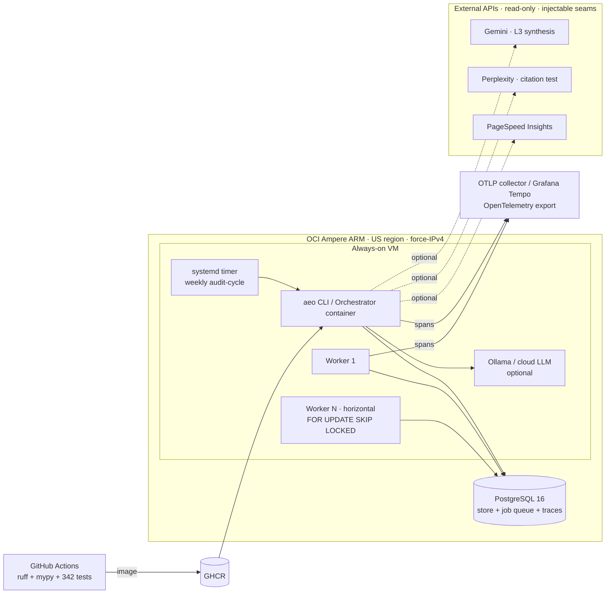

# Deployment Architecture — recommended (OCI ARM, single always-on VM → scale-out)

## Scaling path

| Stage | Topology | Trigger |
|---|---|---|
| **Now** | 1 VM, 1 worker, Postgres on same box | single client / weekly cadence |
| **Scale-out** | N stateless workers claim from the Postgres queue (no broker) | more domains / faster cadence |
| **Managed DB** | Postgres → managed instance (read replicas for reporting) | DB becomes SPOF / reporting load |
| **Async DB** | psycopg2 → asyncpg (per B's proven pattern) | event-loop blocking dominates profile |
| **Multi-region** | per-region workers, central blueprint store | latency / data-residency needs |
